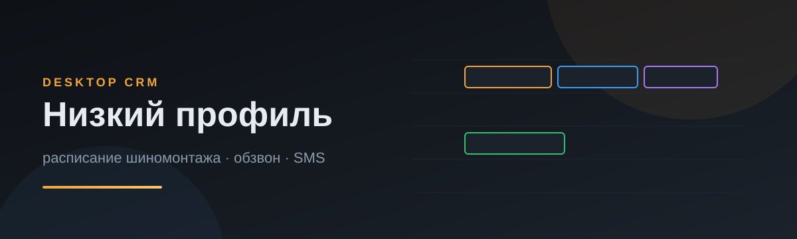
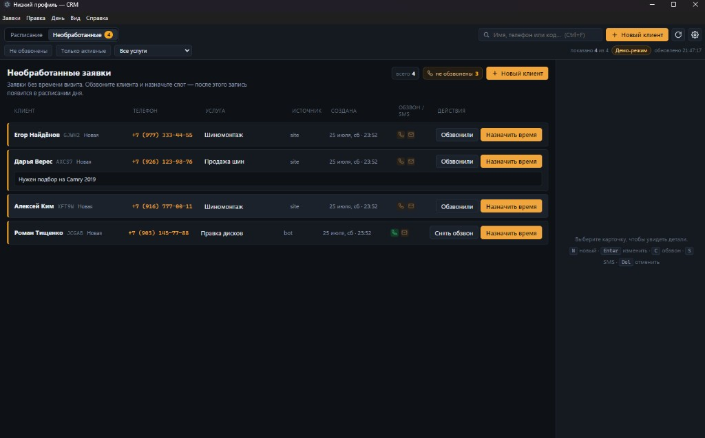
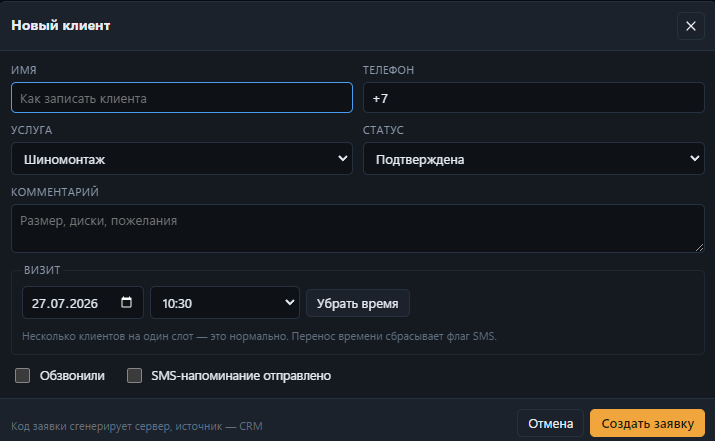
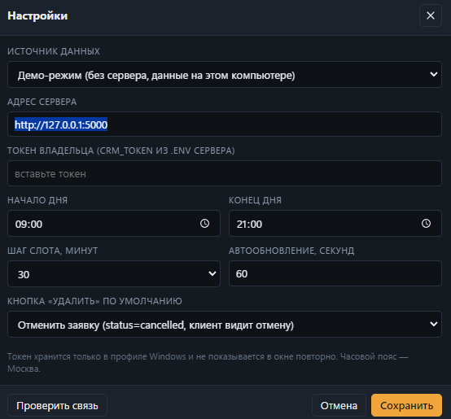

# Низкий профиль — Desktop CRM

<p align="center">
  
</p>

<p align="center">
  <strong>Настольная CRM для шиномонтажа</strong><br/>
  Расписание дня · очередь необработанных заявок · обзвон · SMS-флаги<br/>
  <em>Electron · React · TypeScript · Flask API</em>
</p>

<p align="center">
  
  
  
  
  
</p>

---

## Зачем это

Реальный сервис шиномонтажа «Низкий профиль» (Жулебино, Москва) уже принимал заявки с сайта и управлял ими через Telegram-бота. Администратору нужно было **видеть день целиком**: кто на какое время, кого ещё не обзвонили, ушло ли SMS-напоминание.

Эта CRM — отдельное настольное приложение: плотная сетка слотов, несколько клиентов в одной ячейке, горячие клавиши, без «веб-дашборда в браузере».

| Было | Стало |
|---|---|
| Записи только в Telegram | День на временной сетке |
| Один клиент «в голове» | 2–3 клиента в слот 10:00 — норма |
| Не видно, обзвонили ли | Индикаторы обзвона и SMS |
| Сайт / бот / ручные заметки | Одно хранилище, один REST API |

---

## Возможности

- **Расписание дня** — слоты 15/20/30/60 мин, рабочий день настраивается (по умолчанию 09:00–21:00, Москва)
- **Несколько клиентов в одном слоте** — карточки стеком, счётчик на переполненных ячейках
- **Необработанные** — отдельная страница для заявок без времени (обычно с сайта)
- **Drag & drop** — перенос карточки в слот назначает `visit_at` и сбрасывает SMS-флаг
- **Обзвон / SMS** — два независимых индикатора (`called` ≠ `reminder_sent`)
- **CRUD за секунды** — создать, править, отменить или удалить навсегда
- **Фильтры и поиск** — по имени, телефону, коду, услуге, статусу обзвона
- **Горячие клавиши** — `N` новый, `Enter` править, `C` обзвон, `S` SMS, `Del` отменить
- **Демо-режим** — полный UI без сервера, на локальных данных

---

## Скриншоты

<p align="center">
  
  <br/><em>Необработанные — заявки без времени визита</em>
</p>

<p align="center">
  
  <br/><em>Создание заявки с датой и слотом</em>
</p>

<p align="center">
  
  <br/><em>Демо-режим или подключение к Flask по CRM_TOKEN</em>
</p>

---

## Архитектура

```
┌─────────────────────┐         Bearer token          ┌──────────────────────┐
│  Electron CRM       │  ──────────────────────────►  │  Flask /api/crm/*     │
│  React renderer     │                               │  то же bookings.json │
│  main-process HTTP  │  ◄──────────────────────────  │  что сайт и Telegram │
└─────────────────────┘         JSON Booking          └──────────────────────┘
         │
         │  токен НЕ в renderer
         ▼
   %APPDATA% settings.json
```

**Почему Electron, а не Tauri / веб.** Один runtime — Node.js. Запросы к API идут из main-процесса: не нужен CORS, секрет владельца не попадает в окно. UI — системный шрифт, плотная таблица, нативное меню и диалоги подтверждения.

**Безопасность (заложена в MVP):**

- IPC только из своего окна, whitelist путей `/api/crm`
- SSRF-защита: только `http(s)`, без credentials в URL, `redirect: 'error'`
- токен не отдаётся в renderer повторно (`tokenConfigured`)
- на сервере: сравнение токена через SHA-256 + hmac, антибрутфорс, лимиты полей
- `sandbox: true`, DevTools скрыты в релизной сборке

---

## Стек

| Слой | Технологии |
|---|---|
| Desktop | Electron 31, electron-vite, electron-builder |
| UI | React 18, TypeScript, CSS (без UI-kit) |
| API-клиент | fetch в main-процессе + contextBridge |
| Бэкенд (соседний репо) | Flask, JSON-store, Telegram-бот |

Модель заявки совместима с сайтом и ботом:

```ts
Booking {
  code, name, phone, service, comment,
  status: new | confirmed | in_progress | done | cancelled
  visit_at: "YYYY-MM-DD HH:MM" | ""   // Москва
  called, called_at                   // обзвон
  reminder_sent                       // SMS
  source: site | bot | crm
}
```

---

## Быстрый старт

```bash
# Node.js 18+
npm install
npm run dev          # демо-режим из коробки
```

Подключение к живому серверу: **⚙ Настройки** → источник «Сервер» → URL + `CRM_TOKEN`.

```bash
npm run typecheck
npm run dist         # установщик Windows .exe
```

---

## Структура

```
src/
├── main/          # окно, меню, IPC, HTTP, mock API, security
├── preload/       # contextBridge → window.crm
├── renderer/      # React UI: день, inbox, формы
└── shared/        # типы, время (Europe/Moscow), телефон РФ
```

---

## Дорожная карта

- [x] Сетка дня и multi-booking в слоте
- [x] Страница необработанных заявок
- [x] Демо API + контракт под Flask
- [x] Базовая безопасность IPC / токена
- [ ] Реальная отправка SMS (SMS.ru на бэкенде)
- [ ] Иконка и автообновление установщика
- [ ] macOS / Linux сборки

---

## О проекте

Сделано как рабочий инструмент для конкретного автосервиса и как кейс в портфолио:  
**desktop app + REST + реальный бизнес-процесс**, а не абстрактный ToDo.

Автор: [duryagin228777666-lab](https://github.com/duryagin228777666-lab) · ТГ @CEOOOIP · сервис: шиномонтаж «Низкий профиль», Москва

---

## License

MIT — свободное использование кода; название и бренд сервиса остаются за владельцем.
